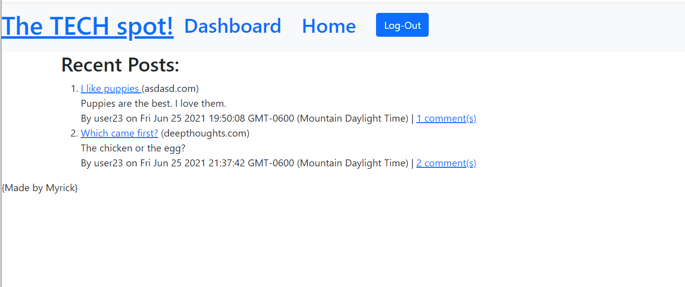

# Tech-Blog
## Table of Contents
* [Description](#description)
* [Installation](#installation)
* [Usage](#usage)
* [Contributing](#contribution)
* [Tests](#tests)
* [Licensing](#licensing)
* [Questions](#questions)

## Description 
CMS-style blog site similar to a Wordpress site, where developers can publish their blog posts and comment on other developers’ posts as well.

## Installation 

* bcrypt
* connect-session-sequelize
* dotenv
* express
* express-handlebars
* express-session
* mysql2
* sequelize

## Usage
This fake blog site app uses the  MVC paradigm in its architectural structure, using Handlebars.js as the templating language, Sequelize as the ORM, and the express-session npm package for authentication.

## Licensing

## Questions
For futher questions feel free to contact me:

Github: [luvthatduck](https://github.com/luvthatduck)
Email:  madeby.jmyrick@gmail.com